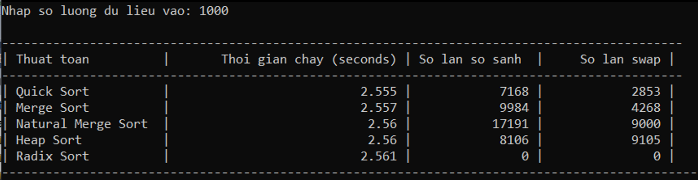

# Complexity_sortAlgorithm

## Thực hiện dự án

Chạy file `.cpp` và nhập lượng dữ liệu đầu vào để khảo sát.

    

## Đánh giá và kết luận

Bảng dữ liệu kết quả trên đã đưa ra thời gian chạy, số lần so sánh và số lần swap của 5 thuật toán sắp xếp khác nhau khi được thực hiện trên tập 1000 phần tử dữ liệu vào.

- Trong số các thuật toán này, Quick Sort và Merge Sort có thời gian chạy khá gần nhau. Tuy nhiên, Quick Sort thực hiện ít lần so sánh và swap hơn so với Merge Sort.
- Natural Merge Sort có số lần so sánh và swap lớn nhất trong số các thuật toán này, tuy nhiên thời gian chạy của nó vẫn khá gần với Quick Sort và Merge Sort.
- Radix Sort không thực hiện lần so sánh nào cả, chỉ thực hiện swap trong trường hợp các phần tử có cùng giá trị. Thời gian chạy của nó cũng tương đối nhanh, tuy nhiên hiệu quả của nó chỉ giới hạn trong trường hợp sắp xếp các số nguyên không âm có số chữ số cố định.

Tóm lại, bảng dữ liệu trên đưa ra một số thông tin về hiệu suất của các thuật toán sắp xếp khác nhau, tuy nhiên để đưa ra đánh giá chính xác về hiệu suất của chúng, ta cần thực hiện nhiều thí nghiệm trên các tập dữ liệu khác nhau và so sánh kết quả.

### Quick Sort

Điểm mạnh: Thực hiện sắp xếp nhanh chóng trên các tập dữ liệu lớn và có hiệu quả tốt hơn so với nhiều thuật toán khác.

Điểm yếu: Hiệu suất của Quick Sort phụ thuộc nhiều vào việc chọn pivot, trong trường hợp xấu nhất thì độ phức tạp của thuật toán có thể tới O(n^2).

- Best case: O(n log n)
- Worst case: O(n^2)
- Average case: O(n log n)

### Merge Sort

Điểm mạnh: Thực hiện sắp xếp ổn định và không phụ thuộc vào dữ liệu đầu vào.

Điểm yếu: Cần sử dụng một mảng phụ để lưu trữ kết quả sắp xếp, do đó yêu cầu nhiều không gian bộ nhớ.

- Best case: O(n log n)
- Worst case: O(n log n)
- Average case: O(n log n)

### Natural Merge Sort

Điểm mạnh: Sử dụng cấu trúc liên kết giúp tránh phải sử dụng mảng phụ, do đó yêu cầu ít bộ nhớ hơn so với Merge Sort.

Điểm yếu: Có thể tốn nhiều thời gian thực hiện việc phân tích dữ liệu đầu vào để tìm ra các đoạn dữ liệu đã sắp xếp.

- Best case: O(n)
- Worst case: O(n log n)
- Average case: O(n log n)

### Heap Sort

Điểm mạnh: Sử dụng cấu trúc heap giúp thực hiện sắp xếp nhanh chóng trên các tập dữ liệu lớn.

Điểm yếu: Yêu cầu thêm một mảng phụ để lưu trữ các phần tử đã sắp xếp, do đó yêu cầu nhiều không gian bộ nhớ.

- Best case: O(n log n)
- Worst case: O(n log n)
- Average case: O(n log n)

### Radix Sort

Điểm mạnh: Thực hiện sắp xếp nhanh chóng trên các số nguyên không âm có số chữ số cố định.

Điểm yếu: Không áp dụng được cho các tập dữ liệu khác ngoài các số nguyên không âm, cũng như yêu cầu thêm một mảng phụ để lưu trữ các phần tử đã sắp xếp.

- Best case: O(kn)
- Worst case: O(kn)
- Average case: O(kn)

Trong đó, n là kích thước của dữ liệu đầu vào và k là số chữ số của phần tử lớn nhất trong dữ liệu đầu vào.
